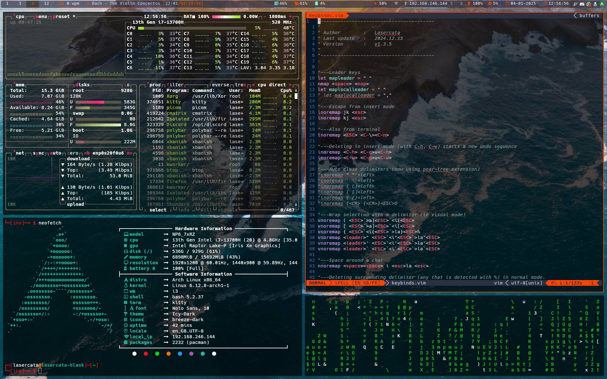

# Dotfiles

This repository contain my personal configuration files for some of the softwares I use. Most are text-based (i.e run in a terminal) and have vim-like key bindings.

See each folder in [`config`](config) for more info.

## Software list
### In this repository :
| Software                           | Description                            |
| --------                           | -----------                            |
| [Alacritty](config/alacritty)      | terminal emulator                      |
| [bash](config/bash)                | shell and command language             |
| [cmus](config/cmus)                | terminal music player (vim-like keys)  |
| [dunst](config/dunst)              | notification daemon                    |
| [elinks](config/elinks)            | terminal web browser                   |
| [git](config/git)                  | version control software               |
| [greenclip](config/greenclip)      | clipboard manager                      |
| [grub](config/grub)                | multiboot boot loader                  |
| [i3wm](config/i3wm)                | keyboard focused window manager        |
| [keyboard](config/keyboard_layout) | personal keyboard layout               |
| [kitty](config/kitty)              | terminal emulator                      |
| [latexmk](config/latexmk)          | LaTeX compiler configuration           |
| [lf](config/lf)                    | faster terminal file explorer          |
| [neofetch](config/neofetch)        | display system information             |
| [neovim](config/nvim)              | text editor                            |
| [picom](config/picom)              | manages transparency in i3             |
| [polybar](config/polybar)          | status bar                             |
| [qt5ct](config/qt5ct)              | fix KDE theme                          |
| [ranger](config/ranger)            | command line file explorer             |
| [rofi](config/rofi)                | can be used as an application launcher |
| [tmux](config/tmux)                | terminal multiplexer                   |
| [htop](config/top/htop)            | process monitor                        |
| [btop](config/top/btop)            | resources monitor                      |
| [udiskie](config/udiskie)          | utility to mount / unmount devices     |
| [vimiv](config/vimiv)              | an image viewer with vim-like keybinds |
| [xorg](config/xorg)                | X11 hardware configurations            |
| [zathura](config/zathura)          | pdf reader with vim-like keys          |

### Other useful softwares :
| Software | Description                                                              |
| -------- | -----------                                                              |
| calcurse | terminal calendar, with vim-like keys                                    |
| w3m      | another terminal web browser                                             |
| fim      | simple image viewer, works in tty (with framebuffer), with vim-like keys |
| mpv      | video player, works in tty                                               |
