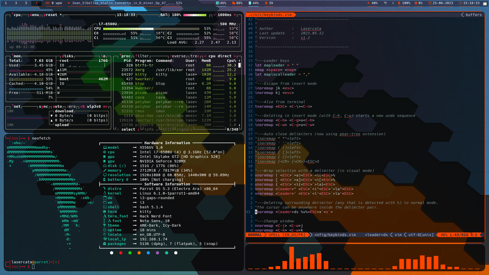

# Dotfiles

This repository contain my personal configuration files for the some softwares that I use. Most are text-based (only run in terminal) and have vim-like key bindings.

See each folder in [`config`](config) for more info.

## Software list
### In this repository :
| Software                      | Description                            |
| --------                      | -----------                            |
| [bash](config/bash)           |                                        |
| [elinks](config/elinks)       | terminal web browser                   |
| [greenclip](config/greenclip) | clipboard manager                      |
| [i3wm](config/i3wm)           | keyboard focused window manager        |
| [kitty](config/kitty)         | terminal emulator                      |
| [neofetch](config/neofetch)   | display system information             |
| [neovim](config/nvim)         | text editor                            |
| [picom](config/picom)         | manages transparency in i3             |
| [polybar](config/polybar)     | status bar                             |
| [qt5ct](config/qt5ct)         | fix KDE theme                          |
| [ranger](config/ranger)       | command line file explorer             |
| [rofi](config/rofi)           | can be used as an application launcher |
| [tmux](config/tmux)           | terminal multiplexer                   |
| [htop](config/top/htop)       | process monitor                        |
| [btop](config/top/btop)       | resources monitor                      |
| [udiskie](config/udiskie)     | utility to mount / unmount devices     |
| [zathura](config/zathura)     | pdf reader with vim-like keys          |

### Other useful softwares :
| Software | Description                                                                                       |
| -------- | -----------                                                                                       |
| calcurse | terminal calendar, with vim-like keys                                                             |
| cmus     | terminal music player, with vim-like keys (there is a polybar widget for cmus in this repository) |
| w3m      | another terminal web browser                                                                      |
| fim      | simple image viewer, works in tty (with framebuffer), with vim-like keys                          |
| mpv      | video player, works in tty                                                                        |
