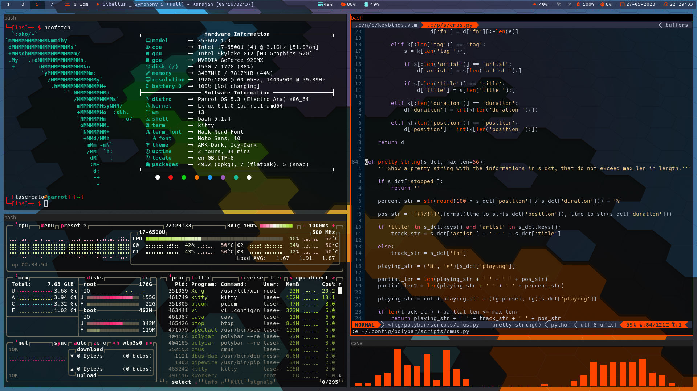

# Dotfiles

This repository contain my personal configuration files for the some softwares that I use. Most are text-based (only run in terminal) and have vim-like key bindings.

See each folder in [`config`](config) for more info.

## Software list
### In this repository :
- bash ;
- elinks (terminal web browser) ;
- greenclip (clipboard manager) ;
- i3wm (keyboard focused window manager) ;
- kitty (terminal emulator) ;
- neofetch (display system information) ;
- neovim (text editor) ;
- picom (for transparency in i3) ;
- polybar (status bar) ;
- qt5ct (fix KDE theme) ;
- ranger (command line file explorer) ;
- rofi (can be used as an application launcher) ;
- tmux (terminal multiplexer) ;
- htop (process monitor) ;
- btop (resources monitor).
- zathura (pdf reader with vim-like keys) ;

### Other useful softwares :
- calcurse (terminal calendar, with vim-like keys) ;
- cmus (terminal music player, with vim-like keys) ;
- w3m (another terminal web browser) ;
- fim (simple image viewer, works in tty (with framebuffer), with vim-like keys)
- mpv (video player, works in tty).
